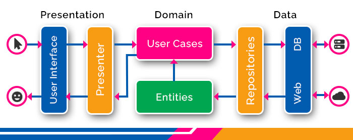
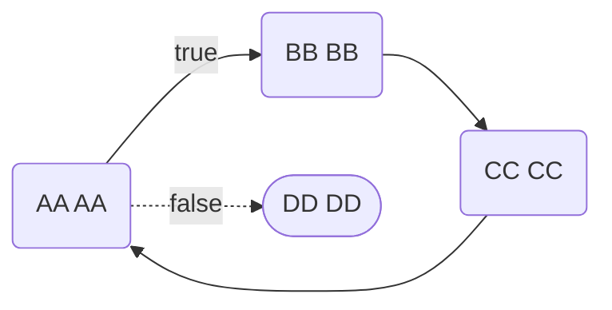

# Base S

## Feature

### Architecture: Clean Architecture



#### Introduce

> The Clean Architecture is a software architecture approach that emphasizes separation of concerns and maintainability through the organization of code into distinct layers.

##### Advantages

1. Modularity: Clean Architecture promotes modularity by dividing the system into layers, with each layer having its own specific responsibility. This makes it easier to understand, maintain, and extend the system.

2. Testability: The separation of concerns and clear dependencies between layers facilitate unit testing. Components can be tested in isolation, leading to more comprehensive test coverage and easier debugging.

3. Independence of Frameworks: Clean Architecture allows you to keep your business logic decoupled from any specific framework or technology. This provides flexibility to adapt to changes in technology without major rewrites.

4. Scalability: The architectural structure makes it easier to scale the application. Since each layer has its own responsibility, scaling one layer does not necessarily require changes in other layers, reducing the risk of introducing bugs.

5. Maintainability: By enforcing clear boundaries and dependencies between layers, Clean Architecture makes the codebase more maintainable. Changes in one part of the system are less likely to have unintended consequences elsewhere.

6. Decoupling from UI: Clean Architecture separates the business logic from the user interface, which makes it possible to have multiple user interfaces (such as web, mobile, or desktop) without impacting the core functionality of the application.

##### Disadvantages

1. Implementing Clean Architecture requires careful planning and understanding of the system's requirements. The initial setup and adherence to architectural principles may introduce complexity, especially in smaller projects or teams with limited experience.

2. Overhead: The additional layers and abstractions introduced by Clean Architecture can lead to increased development time and overhead. Developers need to be mindful of striking a balance between adhering to architectural principles and delivering features in a timely manner.

3. Learning Curve: Clean Architecture may have a steep learning curve for developers who are unfamiliar with the principles of software architecture or design patterns. It requires a shift in mindset from traditional monolithic architectures.

4. Boilerplate Code: In some cases, Clean Architecture can lead to the generation of boilerplate code, especially when implementing interfaces between layers. While this promotes decoupling, it may also increase the amount of code that needs to be written and maintained.

5. Performance Overhead: The additional layers and abstractions introduced by Clean Architecture may incur a slight performance overhead compared to simpler architectures. While this overhead is often negligible, it may be a consideration for performance-critical applications.

6. Potential for Over-Engineering: There's a risk of over-engineering with Clean Architecture, especially if the architectural principles are applied too rigorously or if the project's requirements don't warrant such a complex structure. It's important to strike a balance between architectural purity and practicality.

### State management: flutter_bloc

- makes it easy to separate presentation from business logic, making your code fast, easy to test, and reusable.

### Navigation: go_router, go_router_builder

- A declarative routing package for Flutter that uses the Router API to provide a convenient, url-based API for navigating between different screens.

### DI: get_it, injectable

- is a service locator package in Flutter, and it provides a simple yet powerful solution for dependency management. In software development, a service locator is a design pattern that allows objects to locate and obtain dependencies or services without being aware of how those dependencies are constructed.

- it has a lot features, most one important is registerSingleton, it allows you to register singletons, meaning that there is only one instance of a particular class, and you can lazily load dependencies when needed.

### REST API: dio, retrofit

- A powerful HTTP networking
- retrofit: Retrofit turns your HTTP API into a interface,it's a type conversion dio client generator using source_gen

### DATABASE: isar

- Extremely fast, easy to use, and fully async NoSQL database for Flutter.

### Shared Preferences: shared_preferences, encrypted_shared_preferences

- store small amounts of data in key-value pairs on a user’s device. This data is persistent and can be accessed even after the app has been closed.
- encrypted_shared_preferences: This plugin stores Shared Preferences as encrypted values. It is decrypted when retrieved.

### Data class: freezed, json_serializable

- Code generation for immutable classes that has a simple syntax/API without compromising on the features.
- To generate fromJson and toJson methods.

### Lint: flutter_lints, hodoan_lint

- The Dart linter is a static analyzer for identifying possible problems in your Dart source code. More than a hundred linter rules are available, checking anything from potential typing issues, coding style, and formatting.

### CI/CD: Github Actions

- is a continuous integration and continuous delivery (CI/CD) platform that allows you to automate your build, test, and deployment pipeline. You can create workflows that build and test every pull request to your repository, or deploy merged pull requests to production.

### Unit Test: mocktail, bloc_test, test

- Automated tests help ensure that your app performs correctly before you publish it, while retaining your feature and bug fix velocity.

### Paging: pull_to_refresh

- a widget provided to the flutter scroll component drop-down refresh and pull up load.

### Assets generator: flutter_gen_runner, flutter_launcher_icons, flutter_native_splash

- flutter_gen_runner: The Flutter code generator for your assets, fonts, colors, … — Get rid of all String-based APIs.
- flutter_launcher_icons: A command-line tool which simplifies the task of updating your Flutter app's launcher icon. Fully flexible, allowing you to choose what platform you wish to update the launcher icon for and if you want, the option to keep your old launcher icon in case you want to revert back sometime in the future.
- flutter_native_splash: Customize Flutter's default white native splash screen with background color and splash image. Supports dark mode, full screen, and more.

### Shimmer loading effect

- A package provides an easy way to add shimmer effect in Flutter project

### Utils

- cached_network_image: A flutter library to show images from the internet and keep them in the cache directory.
- envied: A cleaner way to handle your environment variables in Dart/Flutter.
- flutter_flavorizr: A flutter utility to easily create flavors in your flutter application
- dartz: It is Flutter or Dart package for handling error. This is very suitable when you do clean architecture and want to catch the error or success separately.
- copy_with_extension: Defines the annotation used by copy_with_extension_gen to generate copyWith extensions.

## Services

### Firebase

#### Firebase Dynamic link



## Getting Started

### Git flow

#### Branch Rule

```sh
- master    # main branch
- stg       # stg branch
- dev       # dev branch
- feature/* # code feature
- bug/*     # code bug
```

### Requirements

- Dart: 3.2.0
- Flutter: 3.16.0
- DevTools: 2.28.0
- CocoaPods: 1.13.0
- Melos: 5.1.0

### Install

#### Melos

```sh
dart pub global activate melos
```

### Config and run app

- pub get all

```sh
melos pub
```

- build all

```sh
melos build
```

- test all

```sh
melos test
```

```sh
# run dev
flutter run --flavor dev -t lib/main_dev.dart
# run test
## run server mock
melos mock
## run app
flutter run --flavor test -t lib/main_test.dart
```

### Directory Structure

```yml
|-> common
|   '-> lib
|       |-> language
|       |-> utils
|       |   |-> constant
|       |   |   '-> constant
|       |   |-> extensions
|       |   |   '-> extensions.dart
|       |   '-> utils.dart
|       '-> system
|           |-> themes
|           |   '-> themes.dart
|           '-> widgets
|               '-> widgets.dart
|-> domain
|   '-> lib
|       |-> data
|       |   |-> models
|       |   |   |-> local
|       |   |   |   |-> a
|       |   |   |   |   |-> a_local_data_source_stub.dart # for web
|       |   |   |   |   '-> a_local_data_source.dart
|       |   |   |   '-> local.dart
|       |   |   |-> remote
|       |   |   |   '-> remote.dart
|       |   |   '-> models
|       |   |       |-> local
|       |   |       |   |-> a_stub.dart
|       |   |       |   |-> a.dart
|       |   |       |   '-> local.dart
|       |   |       |-> remote
|       |   |       |   |-> a.dart
|       |   |       |   '-> remote.dart
|       |   |       '-> models.dart
|       |   |-> local_data_sources
|       |   |   '-> local_data_sources.dart
|       |   '-> remote_data_sources
|       |       '-> remote_data_sources.dart
|       |-> models
|       |   '-> models.dart
|       |-> repositories
|       |   '-> repositories.dart
|       |-> use_cases
|       |   '-> use_cases.dart
|       '-> services
|           |-> dependency_injection
|           |   '-> service_locator.dart
|           |-> local_database
|           |   '-> local_database.dart
|           '-> network
|               '-> api_client.dart
|-> shared
|   '-> lib
|       |-> core
|       |   '-> env
|       |       '-> env.dart
|       |   '-> isolator
|       |       '-> isolator.dart
|       |-> utils
|       |   '-> utils.dart
|       |-> flavors.dart
|       '-> src
|-> template
|   '-> lib
|       |-> core
|       |   |-> router
|       |   |   |-> router_path.dart
|       |   |   '-> router.dart
|       |   '-> services
|       |       '-> dependency_injection
|       |           '-> service_locator.dart
|       '-> feature
|           '-> feature_a
|               |-> bloc
|               |   |-> a_bloc.dart
|               |   |-> a_event.dart
|               |   '-> a_state.dart
|               |-> widgets
|               '-> feature_a_screen.dart
|-> CHANGELOG.md
|-> release-notes.md
'-> melos.yaml
```

### Test App Directory Structure

```yml
|-> integration_test
|   '-> feature
|       '-> feature_a
|           '-> feature_a_test.dart
'-> test
    |-> utils
    |   '-> dummy
    |       '-> model_dummy
    |           '-> model_dummy.dart
    |-> golden
    |   '-> feature_a
    |       |-> goldens
    |       |-> step
    |       '-> feature_a_test.dart
    |-> unit
    |   '-> feature_a
    |       '-> feature_a_test.dart
    '-> widget
        '-> widget_a
            '-> widget_a_test.dart
```

### Test Domain Directory Structure

```yml
|-> data
|   |-> models
|   |   '-> model_a
|   |       '-> model_a_test.dart
|   |-> local_data_sources
|   |   '-> data_source_a
|   |       '-> data_source_a_test.dart
|   '-> remote_data_sources
|       '-> data_source_a
|           '-> data_source_a_test.dart
|-> models
|   '-> model_a
|       '-> model_a_test.dart
|-> repositories
|   '-> repository_a
|       '-> repository_a_test.dart
|-> services
|   '-> di
|       '-> di_test.dart
|-> use_cases
|   '-> use_case_a
|       '-> use_case_a_test.dart
'-> utils
    '-> dummy
        '-> a_dummy.dart
```
